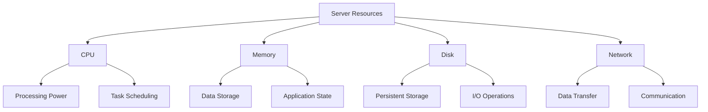
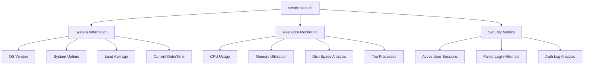
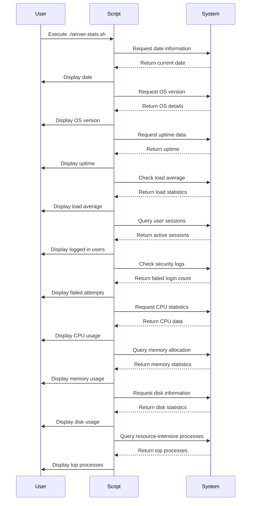
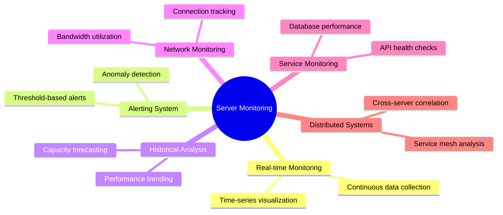

# Building a Comprehensive Server Monitoring System: A First Principles Approach

## Introduction

In today's complex IT infrastructure, understanding server performance is not just a convenience—it's a necessity. This blog post explores the fundamental principles behind server monitoring and dives deep into how we built a comprehensive server statistics tool from scratch.

As engineers, we often rely on sophisticated monitoring tools without understanding their inner workings. By breaking down our approach to first principles, we'll gain insights into not just how to monitor servers, but why specific metrics matter and how they interrelate.

## Understanding the Fundamentals of Server Monitoring

### Why Monitor Servers?

At its core, server monitoring solves several critical problems:

1. **Proactive Issue Detection**: Identifying problems before they impact users
2. **Performance Optimization**: Finding bottlenecks that limit system capability
3. **Capacity Planning**: Understanding resource utilization trends
4. **Security Oversight**: Detecting unusual patterns that may indicate breaches

The foundation of effective monitoring lies in knowing which metrics truly matter. Let's break this down by examining the fundamental resources every server manages.

## The Four Pillars of Server Resources

From first principles, every server manages four essential resources:



Understanding how these resources interact and depend on each other is crucial. For example, insufficient memory can lead to excessive disk swapping, creating an I/O bottleneck that appears as a disk problem but originates from memory constraints.

## Architecture of Our Monitoring Solution

Our server-stats tool follows a modular design pattern where each component focuses on monitoring a specific aspect of the system:



This architecture allows for:
- Independent development of each module
- Easy extensibility to add new metrics
- Clear separation of concerns

## Deep Dive: Implementation From First Principles

### CPU Monitoring

From first principles, CPU usage is fundamentally about time allocation. When we measure CPU percentage, we're asking: "Of the total available CPU time, how much was spent on actual work versus waiting?"

The Linux kernel tracks CPU time in multiple categories:

- **user**: Time spent running user space processes
- **nice**: Time spent running niced processes (with adjusted priority)
- **system**: Time spent in kernel operations
- **idle**: Time when CPU had nothing to process
- **iowait**: Time spent waiting for I/O operations
- **irq/softirq**: Time handling interrupts

Our implementation extracts this data directly from `/proc/stat`:

```bash
function cpu_usage {
    echo "=== Total CPU Usage ==="
    cpu_info=$(grep 'cpu ' /proc/stat)
    user=$(echo $cpu_info | awk '{print $2}')
    nice=$(echo $cpu_info | awk '{print $3}')
    system=$(echo $cpu_info | awk '{print $4}')
    idle=$(echo $cpu_info | awk '{print $5}')
    
    total=$((user + nice + system + idle))
    used=$((user + nice + system))
    
    cpu_percentage=$((100 * used / total))
    
    echo "CPU Usage: $cpu_percentage%"
    echo ""
}
```

While simplified, this function captures the essence of CPU monitoring by calculating the ratio of active time (user + nice + system) to total time.

### Memory Monitoring From First Principles

Memory is fundamentally about allocation of finite storage space. The key insight is understanding the difference between available memory, used memory, and how the system manages memory pressure.

In Linux, the `free` command provides this information in an accessible format:

```bash
function memory_usage {
    echo "=== Total Memory Usage ==="
    mem_info=$(free -m)
    
    total_mem=$(echo "$mem_info" | awk 'NR==2{print $2}')
    used_mem=$(echo "$mem_info" | awk 'NR==2{print $3}')
    
    free_mem=$((total_mem - used_mem))
    
    mem_percentage=$((100 * used_mem / total_mem))
    
    echo "Total Memory: ${total_mem}MB"
    echo "Used Memory: ${used_mem}MB"
    echo "Free Memory: ${free_mem}MB"
    echo "Memory Usage Percentage: ${mem_percentage}%"
    echo ""
}
```

It's worth noting that modern Linux kernels have sophisticated memory management that includes caching frequently used data. A more comprehensive analysis would distinguish between memory used by applications and memory used for cache, which can be released if needed.

## Execution Flow

The overall execution flow of our server monitoring tool follows a sequential pattern:



## Security Considerations

From first principles, system security involves detecting anomalies and unauthorized access attempts. Our tool incorporates basic security monitoring:

1. **Active Sessions**: Shows who is currently logged in, allowing administrators to identify unexpected users
2. **Failed Login Attempts**: A sudden increase in failed logins often indicates a brute force attack

```bash
function failed_login_attempts {
    echo "=== Failed Login Attempts ==="
    sudo cat /var/log/auth.log | grep 'Failed password' | wc -l
    echo ""
}
```

A more comprehensive solution would include:
- Tracking login attempts by IP address
- Monitoring for privilege escalation
- Detecting unusual file system access patterns
- Checking for modifications to critical system files

## Extending The System: Future Directions

From our first principles approach, several enhancements naturally emerge:



## Conclusion

Building a server monitoring system from first principles reveals the fundamental relationships between computing resources and provides deeper insights into system behavior. Our server-stats tool, while simple, demonstrates the core concepts behind effective monitoring.

By understanding the why behind each metric, not just the how, we develop more intuitive insights into server performance and can make better-informed decisions about optimization, scaling, and troubleshooting.

The journey from raw system data to actionable intelligence begins with these fundamentals. As we build more sophisticated monitoring solutions, these principles remain the foundation upon which all effective observability is built.

## About The Author

I'm a system engineer and DevOps enthusiast passionate about understanding complex systems from first principles. This project is part of the roadmap.sh learning path for server administration and monitoring.

---

*For more information about server monitoring and best practices, visit [roadmap.sh/projects/server-stats](https://roadmap.sh/projects/server-stats)*
